<h3><code>jul2264@github ~ $ ./contributions.sh</code></h3>

  

<h3><code>jul2264@github ~ $ whoami</code></h3>
<table>
  <tr>
    <td valign="top" width="370">
      
    </td>
    <td valign="top" width="490">
      
    </td>
  </tr>
</table>

 

<h3><code>jul2264@github ~ $ cat stack.md</code></h3>

 

  

